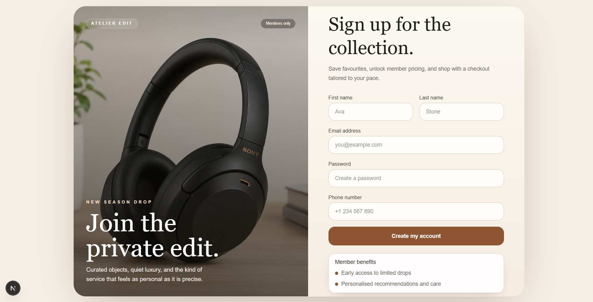
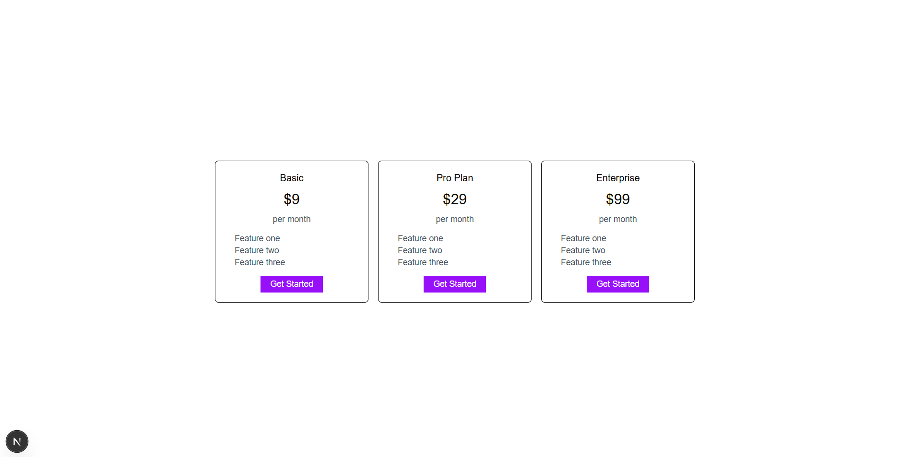
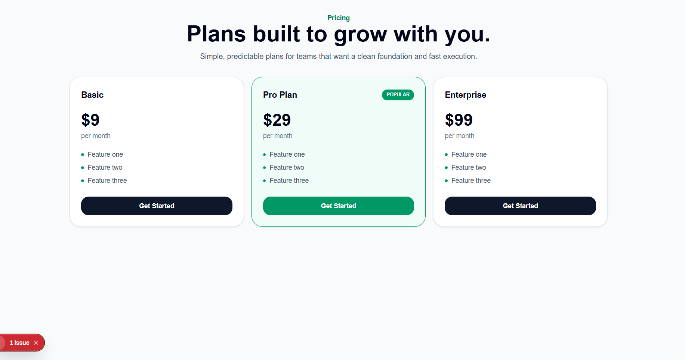

# UI Skills


Skills for Design Engineers

More on [ui-skills.com](http://ui-skills.com/)

Run `npx ui-skills start` to route your agent through the right UI skill set for the task.

## CLI

```bash
npx ui-skills
npx ui-skills start
npx ui-skills categories
npx ui-skills list --category motion
npx ui-skills get baseline-ui
```


## Showcase

See the before and after impact of UI Skills on real components.

### Product Card — anthropics/frontend-design

| Before | After |
|--------|-------|
|  |  |

### Login Page — anthropics/frontend-design

| Before | After |
|--------|-------|
|  |  |

### Pricing Cards — anthropics/canvas-design

| Before | After |
|--------|-------|
|  |  |


## License

Licensed under the [MIT license](https://github.com/ibelick/ui-skills/blob/main/LICENSE).